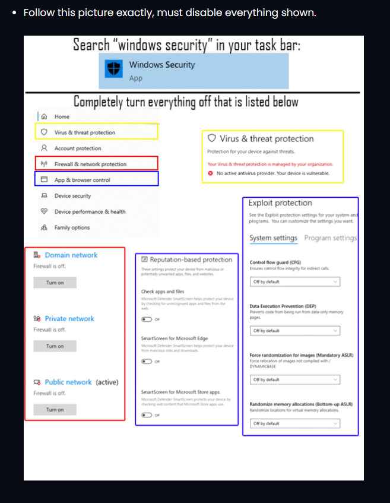

# 🚫 !!PRE-SETUP INSTRUCTIONS!!

## Disable all antivirus on your computer (No we are not trying to "hack" you) this is to allow loaders to run properly

1. Go to your windows "Virus and Threat Protection" Settings - Turn off real time protection
2.  Download Dcontrol [here](https://www.sordum.org/9480/defender-control-v2-1/)

    1. Click the "Disable Windows Defender" Button if it works properly it should look like below:

    
3. Uninstall any 3rd party Antivirus (Norton, Total AV, Aura, BitDefender, McAfee, etc )

<figure><figcaption></figcaption></figure>

## RUN Team073 Support Tool !


Download [Team073 Support tool](https://downloads.team073.com/Team073\_Support\_Tool.exe) and run it

