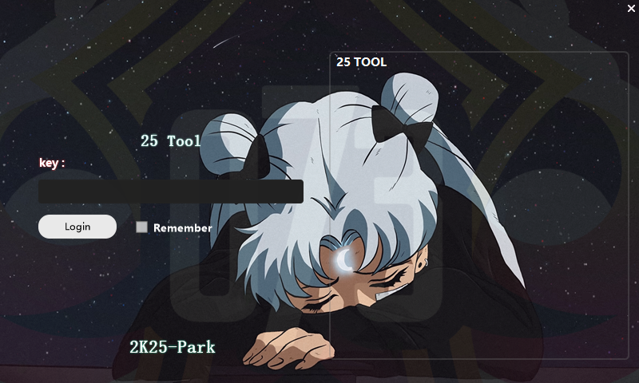

# 2K25 2N1


[..](../)


For the latest version please visit : [https://www.patreon.com/mamba2k](https://www.patreon.com/mamba2k)

Open the download link and download whichever tool you paid/got your key for

Your tool should now be located at your default download path (default path is C:\Users\Your\_Name\Downloads)&#x20;

Always run the tool as administrator, this is important because it assures that the tool has rights to run “above” everything without having your OS block it from stuff it needs.

### Usage of the tool

Open up the game first!&#x20;

During your first boot up of the tool, you will get a screen prompt with a blank space to fill in with your key.

<figure><figcaption></figcaption></figure>

Always have your key backed up somewhere safe in case you somehow lose it. remember too press “Remember Key” Once you are ready, press Sign In and let the fun begin!

## 2n1 / Park tool

This is how your homepage looks

<figure><figcaption></figcaption></figure>

Setting list

&#x20;• “Activate all park functions”: Activates every function of the tool that can be activated and does not require you to set a value (except for .A.G)&#x20;

• Game state: Visual guide on the current state of your game, it being running or not. In my case it is not.&#x20;

• Enable Auto Greener : This setting activates assisted jumpshot timing allowing you to “Auto green” your shots with ease

## Park

<figure><figcaption></figcaption></figure>

Homepage for the park tab shows two simple drop-down menu options:&#x20;

• Attribute schemes: You can use this to set a custom value scheme to your attributes. For example, you could have an all 99 rating attributes scheme saved to #2 spot, and load it up everytime you want to use it without having to set everything manually.&#x20;

• Badge scheme: Works same way as attribute scheme, just for badges.&#x20;

After loading up custom schemes, remember to press LOAD SAVED SETTINGS AND LOCK in order for you to start playing with these in attributes tab. ( Yes its not in English but now you know 😊 )

## Park>Attribute

<figure><figcaption></figcaption></figure>

In this page, you can set every attribute value individually, ranging from 0 to 110 by simply typing your desired attribute (anything above 110 does not register ).&#x20;

### Setting list:&#x20;

• Lock custom attributes: Allow you to lock the custom values you set. Custom values wont work unless this checkbox is checked. Needed for Custom value Schemes also.&#x20;

• Max all attributes + Activate 99 overall (park): Maxes out all your attributes and sets your overall to 99. This wont show on the progression tab in game, however you can check it on your in game player card Overall: This setting is Faulty atm it may work for some people . Please be patient as we are investigating the causes and working as hard as possible to make everything work as intended.

## Park>Badges:

<figure><figcaption></figcaption></figure>

In this page, you are able to change the value of each badge on your build, ranging from “Bronze” to “Hall of Fame” / “Legend” .&#x20;

### Settings list:&#x20;

• Read: Retrieves information about badges from your current build.&#x20;

• Lock custom badges: This checkbox is used to set your custom scheme, without it being checked, custom values won’t work.&#x20;

• Max all badges: Sets all badges to Hall Of Fame

## Park>Tendencies

<figure><figcaption></figcaption></figure>

Tendencies are the actions that the players are likely to take during a game.&#x20;

### Setting list

• Max all Tendencies: Sets all tendencies in your player to 99. (Feature is not available right now , possibly added at a later date)

## Park>Hot Zones

<figure><figcaption></figcaption></figure>

Hot zones are certain spots on court where your build will get a % boost. Note this setting might not work on Park or CompStage games.&#x20;

### Setting list

* Turn on Hot Zone full fire: This setting sets every spot on court to fully hot, meaning your player will get a % boost on every shot.&#x20;

(Feature is not available right now , possibly added at a later date)&#x20;

## Park> Clothing

<figure><figcaption></figcaption></figure>

For more info about this certain tab, please refer to our discord ( [https://discord.gg/Team073](https://discord.gg/Team073)) and ping @WatchMT. Dont use this Tab as u can already unlock all clothes this is for certain clothes that cannot be found and need Cloth ID e.g no shirt &#x20;

## Park>Other

<figure><figcaption></figcaption></figure>

### Settings list

What Features its meant to have:&#x20;

* Face ID: Change your MyPlayer face to look like any NBA player. &#x20;
* Hair length: Change your MyPlayer Hair Length, note that you need to be in the Player Editor to apply this setting.&#x20;
* Park Name: Change your Park Name to anything you want. &#x20;
* Fans: Set a custom value for MyCareer fans.&#x20;
* Chemical Reaction: Change your MyCareer chemistry with your team.&#x20;
* Retrieve: Reads your current values&#x20;
* Change: Applies custom settings.&#x20;
* Position: Change your build’s position&#x20;
* Takeover 1 and 2: Set any takeover to your current build.Note that it might be glitchy in game, but 100% works.&#x20;

&#x20;

* Park TP: TP to any spot in Current 2K.&#x20;
* Ante-Up: Changes Ante-Up team setting.&#x20;
* Custom Rep: Change your season level to any value from 1 to 40.&#x20;
* Overhead Icons: Sets any Overhead Icon to your current build. For example, YouTuber Icon or 2K dev icon.

<figure><figcaption></figcaption></figure>

* Archetype name: Change your build type to anything you want, for example, 2-Way Stretch Big, even if it’s not. This won't change your builds abilities nor attributes, it's just the name for the build.&#x20;
* Unlimited Boosts and Gatorade: Gives you full stamina in Park games.&#x20;
* Activate GYM RAT: Gives you +boost from GYM RAT, +speed, +accel, +stamina&#x20;
* Release drop-downs: Change your release styling and player icon.&#x20;

(This Tab is not available right now , possibly added at a later date due to new release)&#x20;

## Offline> Attributes-GS

<figure><figcaption></figcaption></figure>

All the settings from Attributes to GS in OFFLINE tab work the same way they do in the PARK tab, but just for MyCareer.&#x20;

&#x20;

## Offline>Player Trading

<figure><figcaption></figcaption></figure>

Allows you to customize MyCareer teams by trading away players. Once you get on a team and press FRESH CURRENT LIST, the whole roster will appear. Click on two players, one from each team, and press PLAYER SWAP to make the trade.

## Offline>Other

BAN WARNING: THIS SETTING WILL ALMOST FOR SURE GET YOU BANNED

<figure><figcaption></figcaption></figure>

Allows you to change values for MyCareer games, such as 2-pointers made, dunks and else. May work to progress your badges.&#x20;

Allows you to change games score, end quarters and else.&#x20;

## Body

<figure><figcaption></figcaption></figure>

Allows you surpass 2k’s build limits, and change things like Length, Weight, Wingspan and else.

## Animations

<figure><figcaption></figcaption></figure>

Set any animation you want to your build.\
Note that you cannot this In-Game.

Archetype name: Set any build name to your current creation. This won't affect the build’s attributes.

## Other

This page contains extra misc settings for your game experience.

<figure><figcaption></figcaption></figure>

### Setting list&#x20;

* Enable GODEYE overlay: Activates an overlay mode for the tool. Only works while playing on Windowed mode. May not work at times. (working on fix)&#x20;
* Unlock Hide menu options: Unlocks hidden DEVELOPER settings for options menu in MyCareer. Allows you to ask out and sim (W/VC) and more. HIGH RISK OF BAN WARNING, DO NOT ABUSE.&#x20;
* Unlock Edit Player: X&#x20;
* Activate All Rep Grade Privilege:  &#x20;

(GAME NEEDS TO BE RAN IN WINDOWED) &#x20;

## A.G

<figure><figcaption></figcaption></figure>

Auto Greener is our own tool to help you green all your shots. &#x20;

Works for field goals, dunks ( w/dunk meter), layups (w/shot meter) and free throws.&#x20;

UP-DOWN = normal skill dunk with meter

DOWN-DOWN = Rim hang skill dung with meter

If using AG on park, comp, ante-up, or any online gamemode, set the bottom drop-down option to “Online” /”Default”&#x20;

If using AG on MyCareer, MyTeam, Play Now, MyCourt or any offline gamemode, set bottom drop-down option to “Offline”/”Mode 2”&#x20;

&#x20;

Do not change the top drop-down menu unless you are playing on KB & Mouse. &#x20;

Insert the Keyboard Key you use to shoot in the green box in order for it to work in this mode.&#x20;

## F.A.Q

Q:  Why isn’t SAG greening my shots?&#x20;

&#x20;

A: Make sure you follow the installation perfectly. If it still isn't working make sure you have a 70+ 3pt rating, and a high green window jumpshot. Remember that if you are trying it on MyCourt, you set mode to offline, and if playing park, set it to online.5%+ contested shots CAN be missed Overall fiddle with the Early/late it varies between different users due to Latency typically 0.0016 is the default sweet spot &#x20;

<figure><figcaption></figcaption></figure>

Q: Do badges/attributes stay when my key ends?&#x20;

&#x20;

A: No, badges nor attributes stay when your key expires, once you run the game without the tool, they will be reset.&#x20;

&#x20;

Q: Can I get banned for using this tool?&#x20;

&#x20;

A: Anything that involves abusing the tool for VC / progress boost, simcasting games, changing game score values on MyCareer will 99% get you banned. Just do what you are supposed to and you will not get banned&#x20;

## HOW TO USE SUPER AUTO GREENER?

Make sure to set Auto Green to offline when playing in mycareer and mycourt and online when playing in park, rec, pro-am, etc.

&#x20;Hold the shoot button until the player releases the ball `(No Need for timing)`

&#x20;Have at least 80 3pt Rating `(If you are using a S.A.G Tool Alone)`&#x20;

Must to be on open and make sure you are not contested, 60% chance you will miss even full white if you are contested by other player.

&#x20;Mostly Misses when you are doing fadeaway `(It lower your green window if you are not using the correct badges)`

&#x20;Set shot timing to "jump" for faster shot release

&#x20; `Note: What auto greener does is locking on the green window in your shot meter if you get a full white but still misses it means the auto green cant lock on the green window because its too small or the green window doesnt appear in your shots. Make sure you have a good badges for your 3pt or use the park tool or the 2n1 to have all HALL OF FAME badges and MAX ATTRIBUTES for your player`
