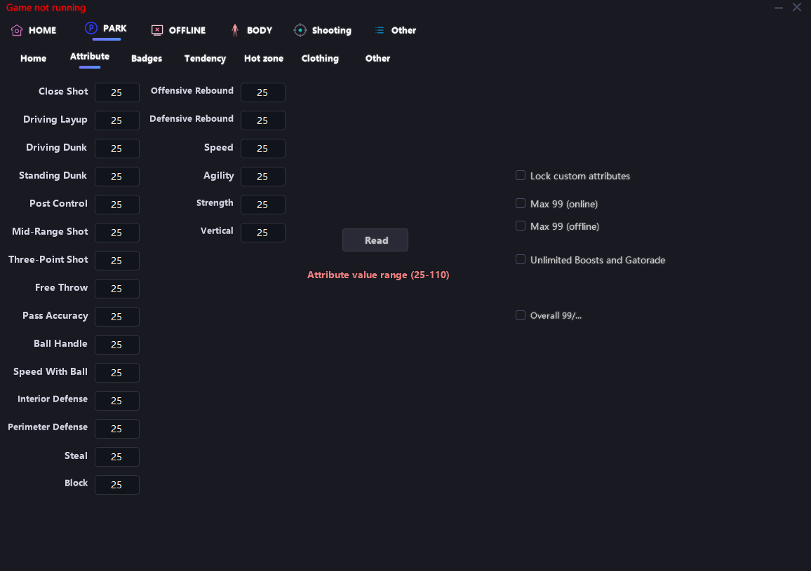
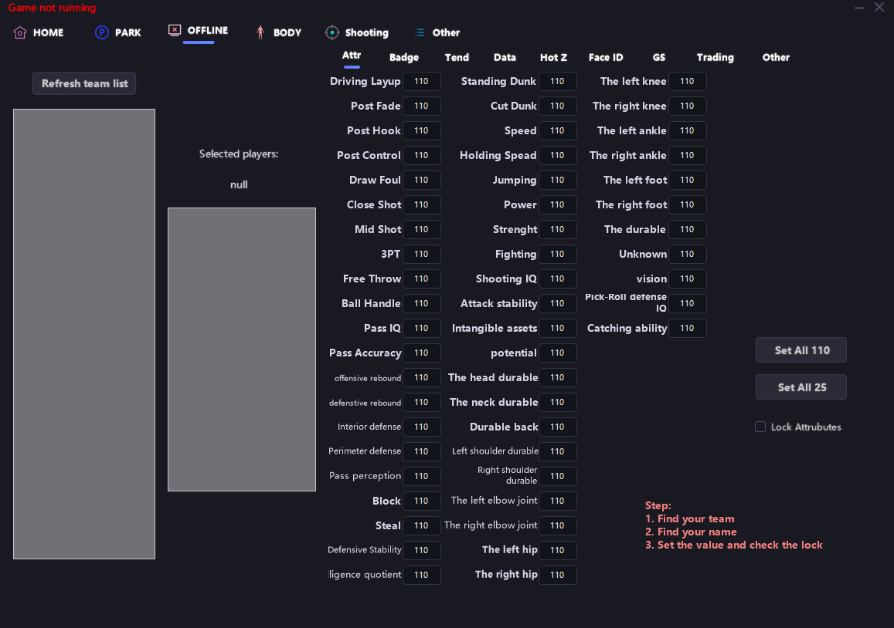
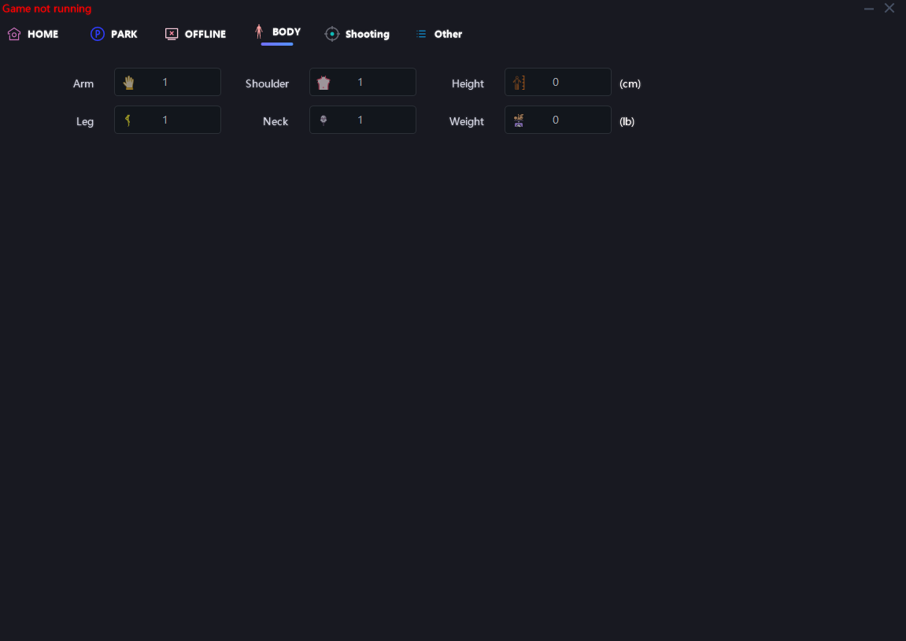
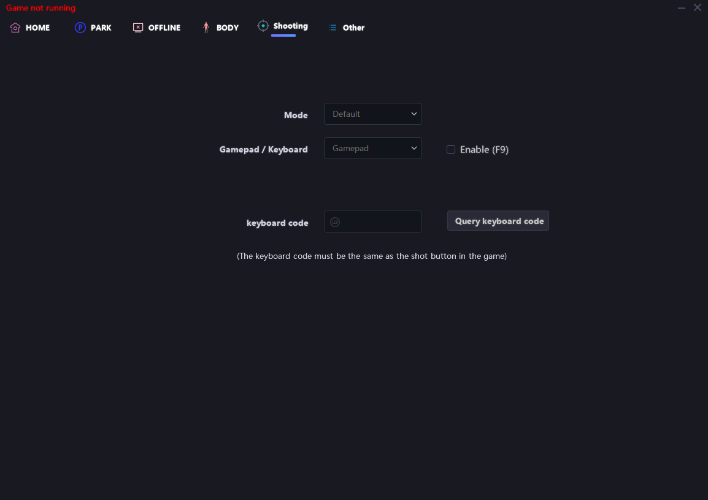

# 2K25 2N1


[..](../)


For the latest version please visit : [https://www.patreon.com/mamba2k](https://www.patreon.com/mamba2k)

Open the download link and download whichever tool you paid/got your key for

Your tool should now be located at your default download path (default path is C:\Users\Your\_Name\Downloads)&#x20;

Always run the tool as administrator, this is important because it assures that the tool has rights to run “above” everything without having your OS block it from stuff it needs.

### Usage of the tool

During your first boot up of the tool, you will get a screen prompt with a blank space to fill in with your key.

<figure><figcaption></figcaption></figure>

Always have your key backed up somewhere safe in case you somehow lose it. remember too press “Remember Key” Once you are ready, press Sign In and let the fun begin!

## 2n1 / Park tool

This is how your homepage looks

<figure><figcaption></figcaption></figure>

Setting list

&#x20;• “Activate all park functions”: Activates every function of the tool that can be activated and does not require you to set a value (except for .A.G)&#x20;

• Game state: Visual guide on the current state of your game, it being running or not. In my case it is not.&#x20;

• Enable Auto Greener : This setting activates assisted jumpshot timing allowing you to “Auto green” your shots with ease

## Park

<figure><figcaption></figcaption></figure>

Homepage for the park tab shows two simple drop-down menu options:&#x20;

• Attribute schemes: You can use this to set a custom value scheme to your attributes. For example, you could have an all 99 rating attributes scheme saved to #2 spot, and load it up everytime you want to use it without having to set everything manually.&#x20;

• Badge scheme: Works same way as attribute scheme, just for badges.&#x20;

After loading up custom schemes, remember to press LOAD SAVED SETTINGS AND LOCK in order for you to start playing with these in attributes tab. ( Yes its not in English but now you know 😊 )

## Park>Attribute

<figure><figcaption></figcaption></figure>

In this page, you can set every attribute value individually, ranging from 0 to 110 by simply typing your desired attribute (anything above 110 does not register ).&#x20;

### Setting list:&#x20;

• Lock custom attributes: Allow you to lock the custom values you set. Custom values wont work unless this checkbox is checked. Needed for Custom value Schemes also.&#x20;

• Max all attributes + Activate 99 overall (park): Maxes out all your attributes and sets your overall to 99. This wont show on the progression tab in game, however you can check it on your in game player card Overall: This setting is Faulty atm it may work for some people . Please be patient as we are investigating the causes and working as hard as possible to make everything work as intended.

## Park>Badges:

<figure><figcaption></figcaption></figure>

In this page, you are able to change the value of each badge on your build, ranging from “Bronze” to “Hall of Fame” / “Legend” .&#x20;

### Settings list:&#x20;

• Read: Retrieves information about badges from your current build.&#x20;

• Lock custom badges: This checkbox is used to set your custom scheme, without it being checked, custom values won’t work.&#x20;

• Max all badges: Sets all badges to Hall Of Fame

## Park>Tendencies

<figure><figcaption></figcaption></figure>

Tendencies are the actions that the players are likely to take during a game.&#x20;

### Setting list

• Max all Tendencies: Sets all tendencies in your player to 99. (Feature is not available right now , possibly added at a later date)

## HOW TO USE SUPER AUTO GREENER

Make sure to set Auto Green to offline when playing in mycareer and mycourt and online when playing in park, rec, pro-am, etc.

&#x20;Hold the shoot button until the player releases the ball `(No Need for timing)`

&#x20;Have at least 80 3pt Rating `(If you are using a S.A.G Tool Alone)`&#x20;

Must to be on open and make sure you are not contested, 60% chance you will miss even full white if you are contested by other player.

&#x20;Mostly Misses when you are doing fadeaway `(It lower your green window if you are not using the correct badges)`

&#x20;Set shot timing to "jump" for faster shot release

&#x20; `Note: What auto greener does is locking on the green window in your shot meter if you get a full white but still misses it means the auto green cant lock on the green window because its too small or the green window doesnt appear in your shots. Make sure you have a good badges for your 3pt or use the park tool or the 2n1 to have all HALL OF FAME badges and MAX ATTRIBUTES for your player`
