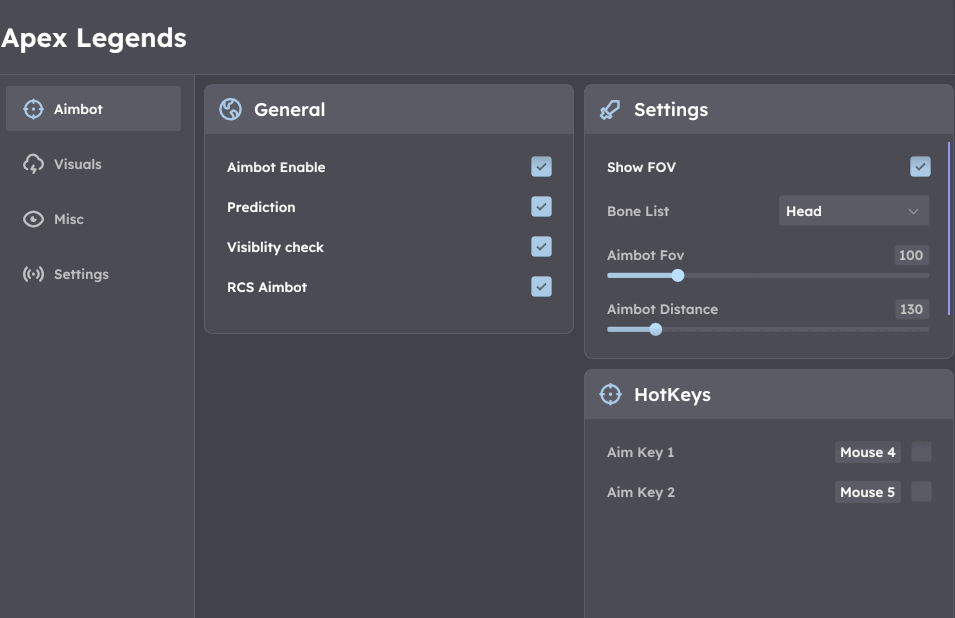

# APEX EXTERNAL

## Apex Legends

1. Make sure Anti-Virus is disabled via DControl, no other anti cheat installed such as Vanguard/FaceIT
2. Make sure C++ Redistributables are installed and DirectX Runtimes
3. Start Apex and put the game in borderless fullscreen
4. Launch the loader you recieved in email and login with your key, on first login loader will first close, open it again, your mouse and keyboard will freeze, once unfrozen tab back into the game and press insert (do not spam it) until menu appears.

<figure><figcaption></figcaption></figure>


[apex-custom-error-fixes.md](../pre-setup/common-error-fixes/apex-custom-error-fixes.md)

