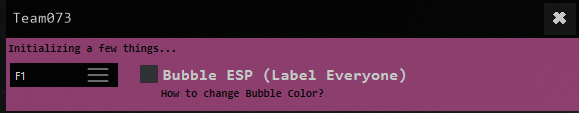

# BUBBLE ESP EXTERNAL

<figure><figcaption></figcaption></figure>

### MW3 BUBBLE | PRE-INJECTION INSTRUCTIONS

Listed Below are The setup instructions for the MW3 Bubble TUTORIAL [Setup video](https://www.youtube.com/watch?v=iKSBTBJ7JMU)

MW3 BUBBLE | INJECTION INSTRUCTIONS

Listed Below are The injection instructions for the MW3 Bubble

### TUTORIAL

[Injection Video](https://www.youtube.com/watch?v=Yxt538MPbis)

MW3 BUBBLE | ERROR TROUBLESHOOTING

Listed Below are The Troubleshooting steps for the MW3 Bubble

Driver Failed to Load at Injection Phase

```
- Uninstall Riot Vanguard (Valorants Anticheat)
```

BSOD ERROR CODE CL.DLL

[ENSURE MEMORY INTEGRITY IS TURNED OFF](https://i.imgur.com/1Z1Q7EL.png)&#x20;

Nothing happends when I open the game

```
+ Please check the setup instructions
```

