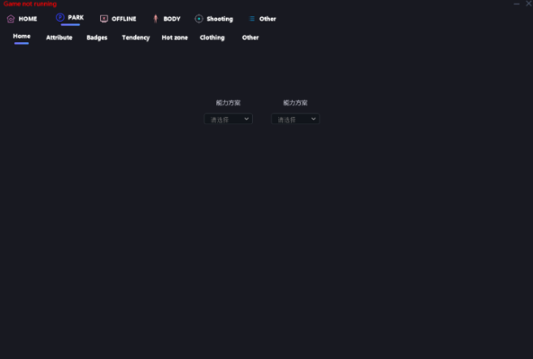

# CHEAT  EXTERNAL


<figure><figcaption></figcaption></figure>



[readme-1.md](../../pre-setup/readme-1.md)


Listed Below are The Setup Instructions for EXTERNAL CHEAT&#x20;

Close Game Launch

```
+ This cheat requires the game launcher to be closed before running
```

Anti-Cheat Software Must Be removed

`Uninstall Anti-Cheat Software`

```
+ Disabled Fast Boot (Recommended, Not Necessary)
+ Open Your system Configuration (press WIN + R -> type msconfig -> Press enter) - Navigate to Services tab
+ Check the Hide All Microsoft Services box
+ Search the list for: Easy Anti-Cheat, BattlEye, etc..
+ Uncheck Anticheat services -> Click Apply -> Restart PC
For Riot Vanguard, ESEA, and FaceIT, you will need to go into your Apps & Programs in Windows settings to uninstall it fully. They are very invasive and will block the driver from loading
```

Disable Windows Defender

`We recommend using` [Defender Control](https://mega.nz/file/Jv0x2S6C#vxR1b33Z6IPdqiiPp9CNpwGO\_pWCn5izfSgOIsjGjH0)

For Your Situational Awareness (FYSA)

```
+ Your PC Will shut down after closing your Game for Security Reasons
```

Tutorial [In-Depth Tutorial](https://youtu.be/gfoEsAfnvks)


### EXTERNAL CHEAT  | INJECTION INSTRUCTIONS

Save Your Keys

```
+ Once you leave the order page, you wont be able to come back. Dont risk losing your keys
```

STEP 1

```
- There is a slim chance your Anti-Virus will flag our loader. This is due to our anti-cracking and protection software. Rest assured the loader is safe. If this happens you will need to disable your anti-virus before processing
```

STEP 2

```
+ Run the loader as Admin
```

STEP 3

```
+ You should be selecting COD MW3
```

STEP 4

```
+ Enter Your Key and Press Enter
```

STEP 5

```
+ Press OK and then Run Call of Duty normally from either Battle.net or Steam. The cheat starts hidden. Press Insert or Home to display it!
```

### EXTERNAL CHEAT  | ERROR TROUBLESHOOTING

Menu Is Not Showing Up for Me

```
+ The button to open the menu is INS (INSERT)
```

After I Press Insert I Hear A Beep But Dont See A Menu

```
+ If you have 2+ Monitors, before loading the chair you should fully disconnect all monitors except 1. Also ensure you close all overlays -> Uninstall wallpaper engine -> Install the following:
```

`DirectX Drivers` - [Here](https://download.microsoft.com/download/1/7/1/1718CCC4-6315-4D8E-9543-8E28A4E18C4C/dxwebsetup.exe)

My ESP is Lagging, What do I do?

```
+ Turn Off XBOX Game Mode
+ Turn off the following
```

`GPU HARDWARE ACCELERATION` - [How To](https://www.wikihow.com/Turn-Off-Hardware-Acceleration)

```
+ Turn Off G-SYNC and V-Sync absolutely wherever possible
+ Do not open Applications which consume alot of resources
```

Error 1 While Launching Loader

```
+ Ensure you do not have Vanguard or FACEIT AC installed on your pc
+ Do not run Loader from Archive, If possible Extract it first
+ If the error Persists, disable TPM in BIOS
```

<figure><figcaption></figcaption></figure>

\+ Most of the time restarting pc will fix this issue


Features not working on Xbox Gamepass&#x20;

* make sure that you have "xbox" written some were on the path to the game

<figure><figcaption></figcaption></figure>

3. The menu disappears, is not visible, visible only for a moment, what should I do?

Close Task Manager, close Xbox Game Bar, close Screen Recorders, update drivers
