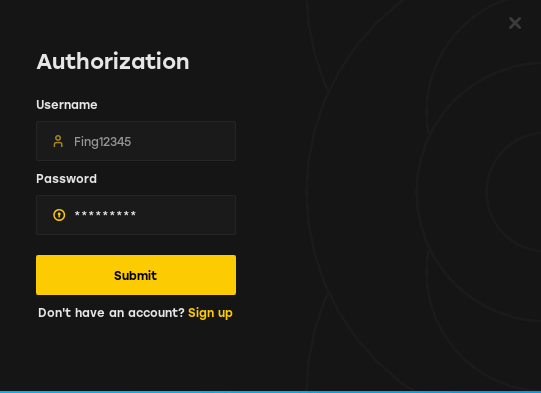

# PERMANENT VAL SPOOFER

<figure><figcaption></figcaption></figure>

## Perm Spoofer

You should do a clean reinstallation of windows, to clean up any traces and any ban logs that valorant generates in Windows

Clean Windows Reinstall

*
*
*
*
*
*
*

*

*

*

*

*
*
*

*

*
*

Disable any and all antivirus that is running on your computer, even in the background, you can use the ["Control Defender"](https://www.sordum.org/files/downloads.php?st-defender-control) tool to permanently disable your Windows antivirus (PASSWORD : sordum)

Disable Windows Update using [**WUB**](https://www.sordum.org/files/downloads.php?st-windows-update-blocker)

Bios Flash

#### &#x20;

1.
2.
3.

#### &#x20;

**After flashing, we must configure our bios:**

AMD BIOSINTEL BIOS

DISABLE TPM 2.0 (Trusted Platform Module)

DISABLE Trusted Computing

DISABLE Secure Boot **and restore/install all secure boot keys**

Disable CSM (Compatibility Support Module)

Disable SVM (CPU Virtualization) in your BIOS

After that, save the changes and exit your BIOS

**Then check that the changes have been made successfully:**

* In windows, Press WinKey + R and type **msinfo32** and press Enter. Check if the value for **Secure Boot State** is **OFF**
* Press WinKey + R and type **tpm.msc** and press Enter. It should say no compatible tpm is found

**If it's as expected, we can continue with the tutorial**

Spoofing PC

#### &#x20;

#### &#x20;

**To bypass TPM 2.0 / HVCI / SB, access our other tab called** VAN RESTRICTION

**To bypass TPM 2.0, access our other tab called TPM BYPASS**

### Additional Spoofing 

If you are still getting banned even after following all the methods listed above, or if you want more security when spoofing to completely avoid a ban, follow the methods listed below

Spoofing your GPU (Optional)

Spoofing your monitor (Optional)

Remember to use [VAN:RESTRICTION](https://guides.moddingassociation.net/permanent-spoofer/van-restriction-bypass) BYPASS or [TPM BYPASS](https://guides.moddingassociation.net/permanent-spoofer/tpm-bypass) you'll be banned from valorant again!

Spoofing your network (Optional)

Some anticheats may ban your router's MAC address and various other aspects of your internet connection. It is recommended to use a VPN while playing, but remember, this is not mandatory.

Recommended VPNs

* ExpressVPN
* NordVPN
* Windscribe
* WARP (if the game has any VPN restrictions)

[PreviousModdingAssociation.net](https://guides.moddingassociation.net/)[NextVAN:RESTRICTION BYPASS](https://guides.moddingassociation.net/permanent-spoofer/van-restriction-bypass)

Last updated 2 hours ago

Perm Spoofer | MA - Guide
