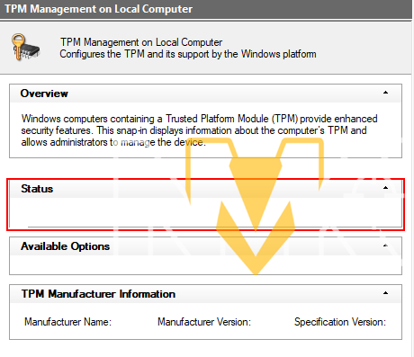
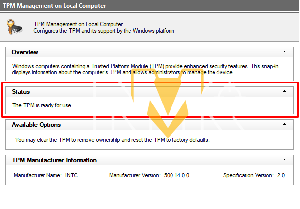

# 🔓 TPM BYPASS

### How to Bypass 



**This method will bypass the following errors**

* **TPM 2.0**


For the bypass to work, you must enable the following in the bios

* Secure boot
* TPM 2.0

After enabling all modules in the BIOS, open the spoofer, log in, and select "TPM Bypass". Then click "Start Bypass". Your mouse/keyboard will "freeze", and once the bypass is complete, they will work normally again, and you will be free to play.


After you do the bypass for the first time, you only need to bypass again if you have turned off or restarted the computer.


#### Checking TPM 

After bypassing TPM, it's always a good idea to check if it’s really working.

* Press WIN + R and type "tpm.msc"
* Check if "Status" is stuck on a white screen

**TPM Bypassed Correctly**

<figure><figcaption></figcaption></figure>

TPM Bypassed Incorrectly

<figure><figcaption></figcaption></figure>

#### Spoofer FAQ 

> > Does this bypass work for the new HVCI Restriction?
>
> **No!** It's only will work for TPM 2.0 Restriction.

> > Does this bypass disconnect me from the game??
>
> **No!** Since **this** bypass only works for TPM, it does not disconnect you from the game.

> > Does the bypass work in any region?
>
> **Yes!** Our bypass is working for all regions.
