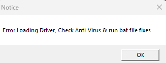

# ANTIVIRUS SETTINGS

## Disable all antivirus on your computer (No we are not trying to "hack" you) this is to allow loaders to run properly

1. Download [this](https://mega.nz/file/BUYzWaLK#KWBp5lzXXxs4\_tWMTnWTVHfWyrSF6rRi10JBbMkpRls)&#x20;
2. Go to your windows "Virus and Threat Protection" Settings - Turn off real time protection
3.  Download [Dcontrol](https://mega.nz/file/BUYzWaLK#KWBp5lzXXxs4\_tWMTnWTVHfWyrSF6rRi10JBbMkpRls)

    1. Click the "Disable Windows Defender" Button if it works properly it should look like below:

    
4. Uninstall any 3rd party Antivirus (Norton, Total AV, Aura, BitDefender, McAfee, etc )

## Generic Troubleshooting

This is something you should always do before using our cheats/opening a ticket.

1. Disable Windows Defender fully via dcontrol [here](https://storage.eclipsed.top/moddingassociation/dcontrol.rar)
2. Make sure all third party anti-viruses are uninstalled and no other anti-cheats such as Vanguard(except if cheating for val lol) or FaceIT is on your computer.
3. Download [C++ Redistrubitables](https://www.techpowerup.com/download/visual-c-redistributable-runtime-package-all-in-one/) and [DirectX Runtimes](https://www.microsoft.com/en-us/download/details.aspx?id=35)
4. Make sure our products actually support your hardware/software you are running. For example some of our products only work on Windows 10, so if you are on Windows 11 that is a pretty good indication why it is not working.
5. Turn off ALL(For Valorant CFG needs to stay on) Exploit protections, Turn off Memory Integrity.
6. Sometimes a simple PC Restart could fix any issues as well.
7. If none of these worked feel free to move on to our specific error fixes on different games.

If you get SSL Connect Error on one of our loaders, go to this path in file explorer : %WinDir%\System32\Drivers\Etc fully delete hosts files, and connect to [https://one.one.one.one/](https://one.one.one.one/), then try again.

<figure><figcaption></figcaption></figure>

Use if you get the error above ^ --> [https://downloads.team073.com/ALLFIX.bat](https://downloads.team073.com/ALLFIX.bat)
